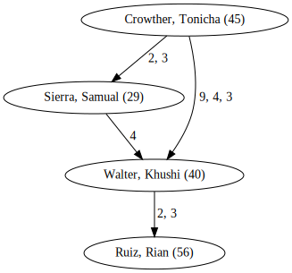

# fp-ts-graph

Immutable, functional graph data structure for [fp-ts](https://github.com/gcanti/fp-ts).

The graph is directed and cyclic.

```ts
type Graph<Id, Edge, Node> = ...
```

## Install

```bash
npm install fp-ts @no-day/fp-ts-graph
```

## Docs

[API](https://no-day.github.io/fp-ts-graph/modules/index.ts.html)

## Examples

### Define Types

```ts
// examples/types.ts

import { Graph } from '@no-day/fp-ts-graph';

// First, let's define some custom Id, Edge and Node type for our Graph

export type MyId = number;

export type MyNode = { firstName: string; lastName: string; age: number };

export type MyEdge = { items: number[] };

// With this we can define a customized Graph type

export type MyGraph = Graph<MyId, MyEdge, MyNode>;
```

### Build Graph

```ts
// examples/build-graph.ts

import Graph, * as graph from '@no-day/fp-ts-graph';
import * as fp from 'fp-ts';

// We import our types from the previous section
import { MyEdge, MyId, MyNode, MyGraph } from './types';

// To save some wrting, we define partially applied versions of the builder functions

const empty = graph.empty<MyId, MyEdge, MyNode>();
const insertNode = graph.insertNode(fp.eq.eqNumber);
const insertEdge = graph.insertEdge(fp.eq.eqNumber);

// Then, let's fill the graph with Data.

export const myGraph: fp.option.Option<MyGraph> = fp.function.pipe(
  // We start out with and empty graph.
  empty,

  // And add some nodes to it.
  insertNode(1001, {
    firstName: 'Tonicha',
    lastName: 'Crowther',
    age: 45,
  }),
  insertNode(1002, {
    firstName: 'Samual',
    lastName: 'Sierra',
    age: 29,
  }),
  insertNode(1003, {
    firstName: 'Khushi',
    lastName: 'Walter',
    age: 40,
  }),
  insertNode(1004, {
    firstName: 'Rian',
    lastName: 'Ruiz',
    age: 56,
  }),

  // Then we connect them with edges, which can have data, too

  fp.option.of,
  fp.option.chain(insertEdge(1001, 1002, { items: [2, 3] })),
  fp.option.chain(insertEdge(1002, 1003, { items: [4] })),
  fp.option.chain(insertEdge(1001, 1003, { items: [9, 4, 3] })),
  fp.option.chain(insertEdge(1003, 1004, { items: [2, 3] }))
);
```

### Debug graph visually

```ts
// examples/debug-visually.ts

import * as graph from '@no-day/fp-ts-graph';
import * as fp from 'fp-ts';

// We import our graph from the previous section
import { myGraph } from './build-graph';

fp.function.pipe(
  myGraph,

  // We need to map over the graph as it may be invalid
  fp.option.map(
    fp.function.flow(
      // Then turn the edges into strings
      graph.mapEdges(({ items }) => items.join(', ')),

      // The same we do with the nodes
      graph.map(
        ({ firstName, lastName, age }) => `${lastName}, ${firstName} (${age})`
      ),

      // For debugging, we generate a simple dot file
      graph.toDotFile((_) => _.toString())
    )
  ),

  // Depending on if the graph was valid
  fp.option.fold(
    // We either print an erroe
    () => console.error('invalid graph!'),

    // Or output the dot file
    console.log
  )
);
```

If you have [graphviz](https://graphviz.org) installed you can run the following in the terminal:

```bash
ts-node examples/debug-visually.ts | dot -Tsvg > graph.svg
chromium graph.svg
```


